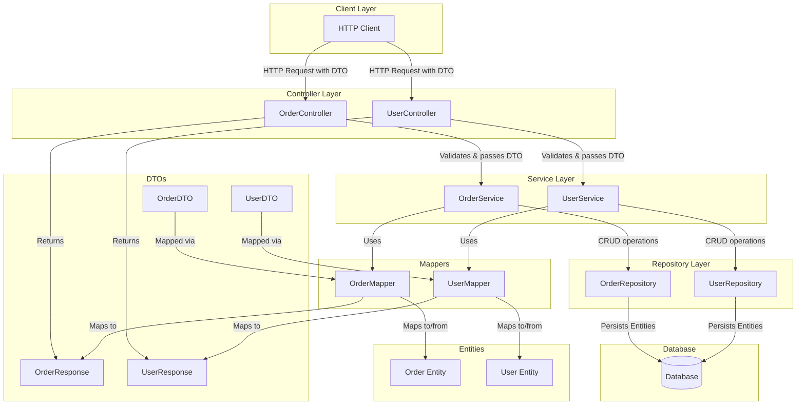

# Spring Boot Incremental Project

## Overview

## How To Build / Debug

## Features Implemented
 
- Application
- Endpoint
- Project Layout

```java.lang.reflect.InvocationTargetException

could not prepare statement [user lacks privilege or object not found: USER in statement [select u1_0.id,u1_0.name from User u1_0 where u1_0.id=?]] [select u1_0.id,u1_0.name from User u1_0 where u1_0.id=?]; SQL [select u1_0.id,u1_0.name from User u1_0 where u1_0.id=?]
```

# Spring Boot Application Architecture

## Layered Architecture with DTOs and Mappers



## Component Details

### Controllers
- Handle HTTP requests/responses
- Validate incoming DTOs
- Convert HTTP status codes
- No business logic
- Use services for processing

### Services
- Contain business logic
- Transaction management
- Use mappers for DTO <-> Entity conversion
- Orchestrate multiple operations
- Call repositories for persistence

### Repositories
- Handle database operations
- Work with Entity objects
- Extend JpaRepository
- Provide CRUD operations
- Custom query methods

### DTOs (Data Transfer Objects)
- Input validation
- API contract
- Request/Response separation
- No business logic
- Immutable (Records in Java 17+)

### Entities
- JPA annotations
- Database mapping
- Domain logic
- Lifecycle callbacks
- Relationship mappings

### Mappers (MapStruct)
- Compile-time mapping generation
- Type-safe conversions
- Custom mapping methods
- Nested object mapping
- Collection mapping

## Code Structure Example

```java
// Controller Layer
@RestController
@RequestMapping("/api/orders")
public class OrderController {
    @PostMapping
    public OrderResponse createOrder(@Valid @RequestBody OrderDTO dto)
}

// Service Layer
@Service
public class OrderService {
    public OrderResponse createOrder(OrderDTO dto)
}

// Repository Layer
@Repository
public interface OrderRepository extends JpaRepository<Order, Long> {
}

// DTO
public record OrderDTO(
    String userName,
    List<OrderItemDTO> items
)

// Response DTO
public record OrderResponse(
    Long id,
    String userName,
    OrderStatus status
)

// Entity
@Entity
public class Order {
    @Id @GeneratedValue
    private Long id;
    private String userName;
}

// Mapper
@Mapper(componentModel = "spring")
public interface OrderMapper {
    Order toEntity(OrderDTO dto);
    OrderResponse toResponse(Order order);
}
```

## Data Flow

1. Client sends HTTP request with DTO
2. Controller validates DTO
3. Controller calls Service
4. Service uses Mapper to convert DTO to Entity
5. Service applies business logic
6. Service uses Repository for persistence
7. Service uses Mapper to convert Entity to Response
8. Controller returns Response to Client

## Best Practices

1. Keep layers separate and focused
2. Use DTOs for input/output
3. Entities for persistence
4. MapStruct for object mapping
5. Validate at Controller level
6. Business logic in Service layer
7. Repository for data access only
8. Clear separation of concerns